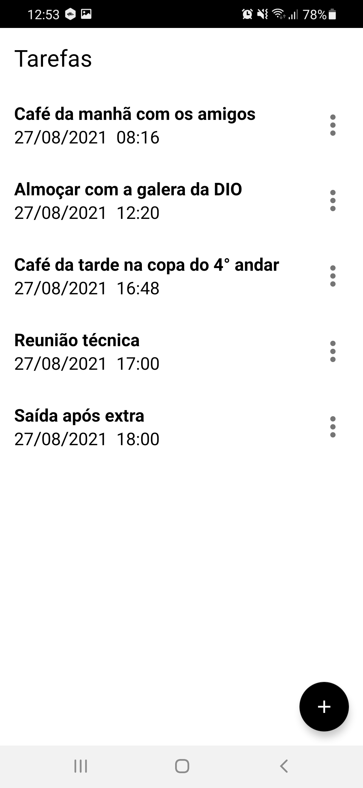
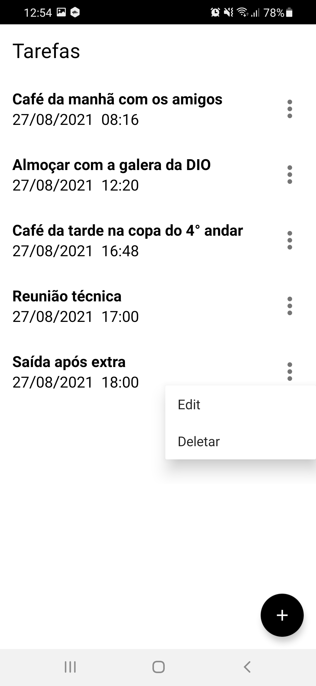
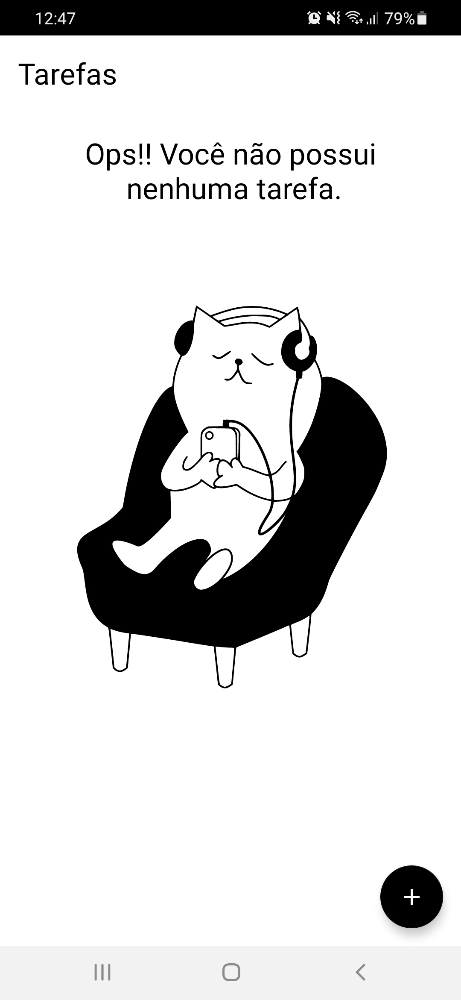

# Layout

   

# Welcome TODO-list App
This application was developed to be delivered as a final project for Bootcamp Santander Mobile, in partnership with DIO - Digital Innovation One.
The purpose of this app is to show a little about my professional experience.
This project was created to show a list of the tasks.

# Project
This project make use some technologies requested by market to help in some scenarios that simulate day to day of a android developer  
My reason for creating the app was learning about the Kotlin language that I have been working hard to learn. 
I also had the opportunity to learn more about android application development. 

# Feature
In this app you can: 
- Create a task.
- List all tasks.
- Update a task.
- Delete a task.
- Empty state to give feedback to user that he can create tasks.

# Technologies
This project use the follow technologies and tools:
- [ViewBinding](https://developer.android.com/topic/libraries/view-binding) - Is a feature that allows you to more easily write code that interacts with views.
- [ConstraintLayout](https://developer.android.com/training/constraint-layout) - ConstraintLayout allows you to create large and complex layouts with a flat view hierarchy
- [MDC](https://material.io/components?platform=android) - Material Components are interactive building blocks for creating a user interface.  
- [Room](https://developer.android.com/jetpack/androidx/releases/room) - Create, store, and manage persistent data backed by a SQLite database.
- [LiveData](https://developer.android.com/jetpack/androidx/releases/lifecycle) - Build lifecycle-aware components that can adjust behavior based on the current lifecycle state of an activity or fragment.
- [Kotlin Coroutines](https://developer.android.com/kotlin/coroutines) - A coroutine is a concurrency design pattern that you can use on Android to simplify code that executes asynchronously.
- [Recyclerview](https://developer.android.com/guide/topics/ui/layout/recyclerview?hl=pt-br) - Display large sets of data in your UI while minimizing memory usage.
- [MVVM Architecture](https://medium.com/upday-devs/android-architecture-patterns-part-3-model-view-viewmodel-e7eeee76b73b) - Model-View-ViewModel Pattern.
- [Koin](https://insert-koin.io/) - A smart Kotlin injection library to keep you focused on your app, not on your tools. 

[For mode details click here](https://developer.android.com/jetpack/)
